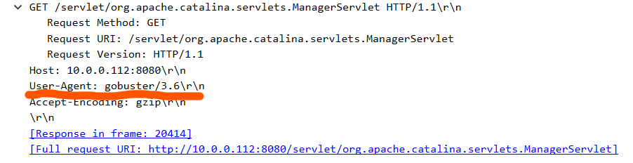
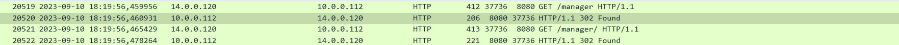

В этой лабораторной работе мы анализируем трафик, записанный при компрометации Apache Tomcat веб-сервера. Для этого используем ПО **Wireshark**.

---

Для начала у нас спрашивается о проводимом сетевом сканировании, а именно о его источнике. Здесь довольно характерный признак - большое количество запросов. Помимо прочего, важным выдающим факторов является тип запроса - так, например, имеющиеся в pcap-файле TCP-запросы с флагами **RST, ACK** являются хорошими признаками сканирования - они позволяют обходить некоторые ограничения на **SYN, ACK**, вынуждая сервер давать ответ.
Как раз эти факторы выдают нам ответ - источником бед является **IP-адрес 14.0.0.120**. Это и есть первый ответ.

Основываясь на полученном адресе, используем who.is и там легко находим страну, которой он принадлежит. Это Китай, поэтому ответ на второй вопрос - **China**.

Следующий вопрос касается порта админ-панели сервера. Эту информацию также можно выделить в трафике по обращения данного найденного IP адреса, однако, порт установлен дефолтный, информация в Интернете совпадает с нашими данными - это **8080**.

Четвертый вопрос касается используемого вспомогательного программного обеспечения для проведения атаки (сканирования). Для нахождения ответа на него, отлистываем к большому количеству HTTP-запросов, и среди них выбираем те, где прописан **User-Agent**.
Иногда это будут браузеры, но среди прочего обнаружится и такая информация - интересующее нас ПО называется **gobuster**.

Теперь необходимо понять, какую директорию нашел злоумышленник в ходе перебора. Для этого смотрим далее по **http-запросам**. Среди прочего найдем следующую картину:

Код 302 свидетельствует об успешном нахождении, однако, прямого доступа в корень директории это не даёт. Впрочем, к поддиректориям доступ уже может найтись, это злоумышленник далее и делает - перебирает поддиректории. Тем не менее, ответ на вопрос - **/manager**.

После нахождения директории, злоумышленник начинает подбирать учетные данные для доступа. Это видно по телу http-запроса, которые следует далее за найденным выше. Среди прочих попыток - "admin:", "admin:admin". Успешной парой оказывается - "**admin:tomcat**"

После получения доступа к панели, злоумышленник загружает туда вредоносный файл для получения **reverse-shell** на своё устройство. Загрузка такого файла видна, если отфильтровать пакеты по IP злоумышленника и типу HTTP-запроса, POST. Далее необходимо нажать правой кнопкой мыши по пакету, перейти в пункт **Отслеживание** , HTTP-поток, и в представленном окне мы увидим имя файла с расширением. Это - **JXQOZY.war**

Финальный ответ откроется с помощью фильтра **ip.src == 14.0.0[.]120 && tcp.flags == 0x012**. Будет два пакета, начинающих TCP-поток. Если отследить первый, то мы найдем ответ в виде 14.0.0[.]120:443. Второй поток свидетельствует о завершении сеанса. Нам нужен первый, и так мы легко находим ответ.