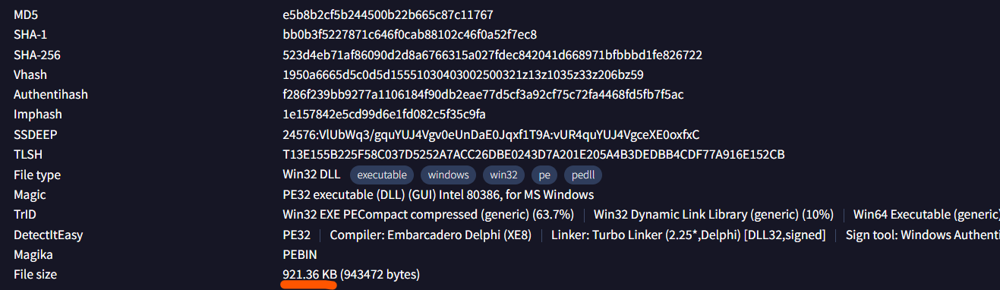
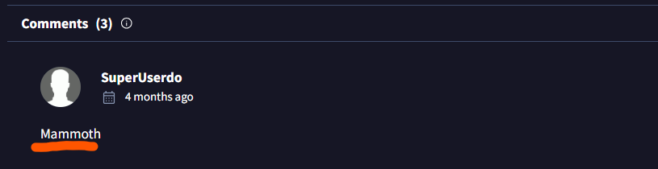

0. First of all, we in lab's archive we can see only one file ==*"hash.txt"*== with MD5 hash in it. There is also a hint - we need to use ==VirusTotal, Hybrid Analysis== or some kind of TI (Threat Intelligence) platform. Let's use **VirusTotal.com**
   

---

1. **In KB, what is the size of the malicious file?**
   After applying MD5 hash into search bar, we see main menu with **44** alerts from different sources.
   We need to choose **Details** panel and in the bottom of it's section *Basic properties* we'll find filesize.
   
2. **What word** do the threat actors use in log messages to describe their victims, based on the name of an ancient hunted creature?
   First of all, let's explore "Community" panel. Sometimes there can be some usefull hints and comments from other TI Specialists. We get lucky today - last comment is similar to what we look for.
   