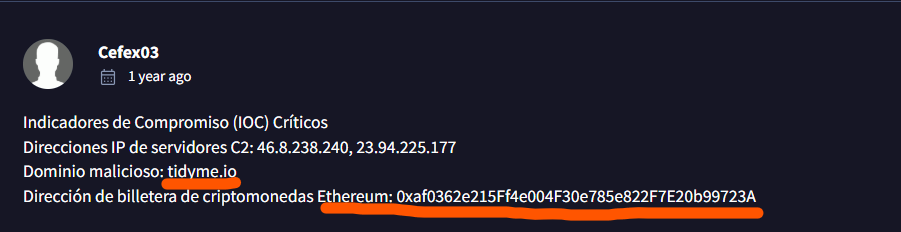
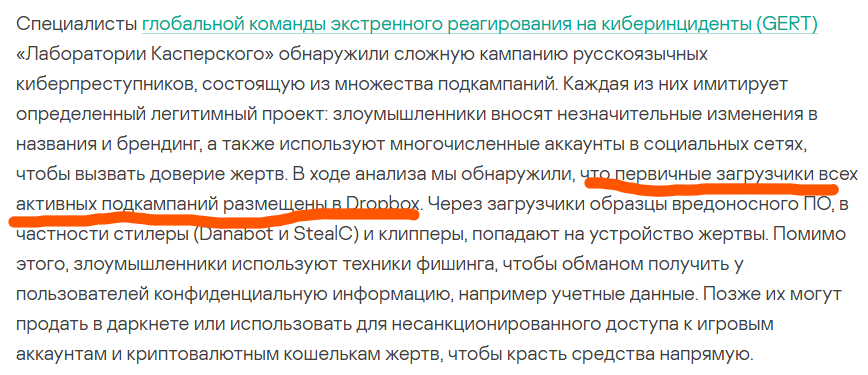
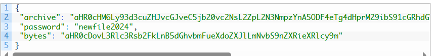
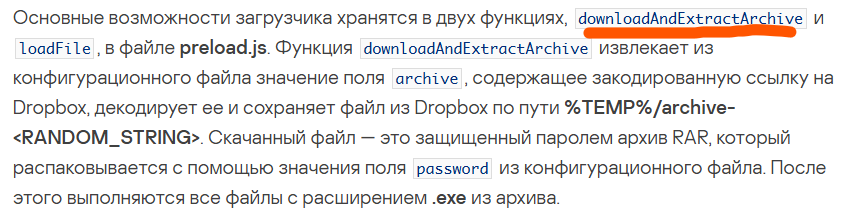
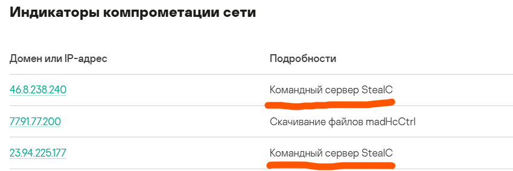

0. Firstly, we in lab's archive we can see only one file ==*"hash.txt"*== with MD5 hash in it. There is also a hint - we need to use ==Virus Total, Hybrid Analysis== or some kind of TI (Threat Intelligence) platform. Let's use **VirusTotal.com**
   

---

1. **In KB, what is the size of the malicious file?**
   After applying MD5 hash into search bar, we see main menu with **44** alerts from different sources.
   We need to choose **Details** panel and in the bottom of it's section *Basic properties* we'll find **file size**.
   
2. **What word** do the threat actors use in log messages to describe their victims, based on the name of an ancient hunted creature?
   Foremost, let's explore "Community" panel. Sometimes there can be some useful hints and comments from other TI Specialists. We get lucky today - last comment is similar to what we are looking for.
   
3. What is the name of the malicious website the attacker created to simulate this platform?
   As in the previous question, let's explore **Community** section. In another comment, that has been created earlier we can find another portion of useful information - there is also an answer for #9 question
   
4. Which cloud storage service did the campaign operators use to host malware samples for both macOS and Windows OS versions?
   From this step (honestly, from 2nd) we enforced to use another TI Platform - Secure List. With SHA-256 hash from Virus Total of malicious DLL, we can search relative for our sample information. There is one article about Tusk Infostealer campaign (https://securelist.ru/tusk-infostealers-campaign/110460/). In the preview section of the article we can easily find the answer - **Dropbox**.
   
5. What is the password for decompression found in this configuration file?
   We continue searching SL article, and found another answer - *password* (**newfile2024**) and base64 string (we need only password).
   
6. What is the name of the function responsible for retrieving the field archive from the configuration file?
   Soon after previous question we can see next answer. Loader uses mainly two function - *downloadAndExtractArchive* and *loadFile*. For our answer we need the first one.
   
7. What is the name of the legitimate translator, and what is the name of the malicious translator created by the attackers?
   Step by step we discover the article (routine for TI) and found information about some fake translator **voico.io**, that's used by adversaries. There we also can see the original one - **yous.ai**. 
   
8. What are the IP addresses of the **StealC C2 servers** used in the campaign?
   We go down the article, where usually IoC's located. Here we can find information about two C&C servers.
   
9. What is the address of the Ethereum cryptocurrency wallet used in this campaign?
   We can find this information both in the article or in Virus Total. **It's mentioned in this guide in #3 question**.
   

