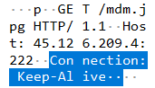

В этом задании нам предстоит анализировать pcap-файл записанного трафика для анализа вредоносной активности и действий злоумышленников. Для работы с трафиком нам понадобится **Wireshark**.

Перво-наперво мы хотим понять, откуда был загружен вредонос первой стадии. Ответ встречает нас на 12 запросе данного pcap-файла. Это GET-запрос следующего вида:

Таким образом ответ **№1 - xttp://45.126[.]209.4:222/mdm.jpg**

Второй вопрос касается провайдера, которому принадлежит данный IP-адрес. Используем для этой цели VirusTotal - и видим в самом верху строку **ReliableSite.Net LLC**. Из всего этого нам нужна только одна часть - **ReliableSite** (**№2 - ReliableSite**)

Для следующего результата придется повоевать. Сначала в Wireshark выбираем фильтр **tcp.stream eq 1**, *это выделит поток, по которому передавался файл* (здесь есть и альтернатива - можно напрямую экспортировать объекты из Wireshark, так мы получим сразу оба файла, но нам сейчас интереснее первый способ).

Далее с первых пакетов, нажимаем правой кнопкой мыши по одному, выбираем **отслеживать** и затем **выбираем TCP-поток**. Это выдаст нам переданные файлы в открытом виде. Здесь мы увидим две переменные, в которых в HEX-представлении зашиты два файла. Эти переменные называются `$hexString_bbb` и `$hexString_pe`. 

Их содержимое мы копируем и удаляем из них символы нижнего подчеркивания. Автоматически сделать это можно, например, с помощью CyberChef.
*Получатся два исполняемых файла*, хеш которых мы высчитываем и один из них забираем для ответа - **1eb7b02e18f67420f42b1d94e74f3b6289d92672a0fb1786c30c03d68e81d798**

По данному хешу выполняем поиск на VirusTotal, и находим быстрый ответ на четвёртый вопрос, изучив выдачу антивирусного средства *AliCloud* - это **Rat:Win/AsyncRAT.Stub**. Из всего этого нам нужно **asyncrat** - это и есть ответ на вопрос о семействе вредоносного ПО.

