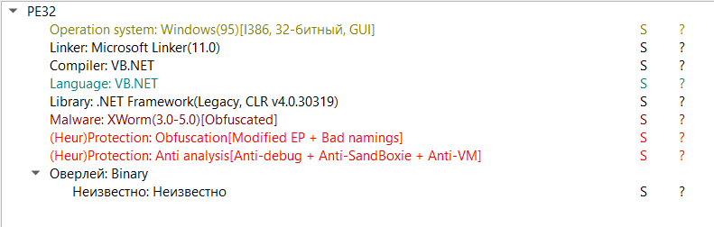
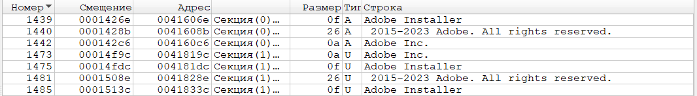
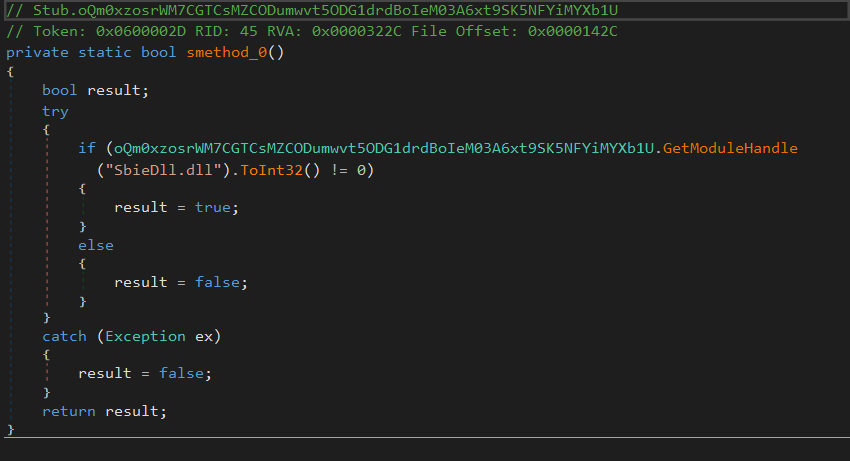
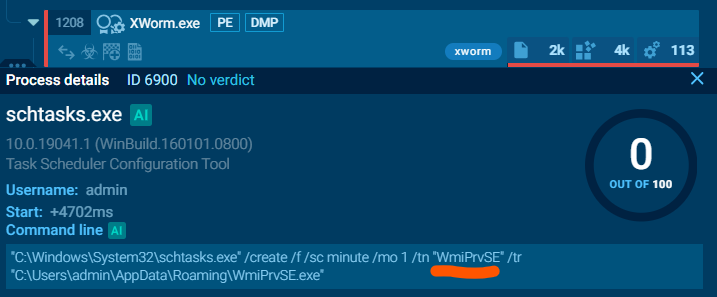
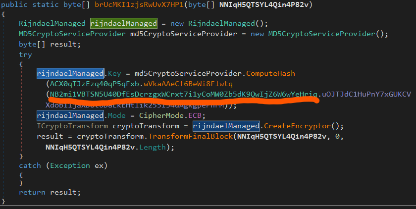
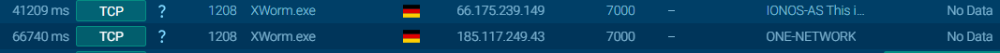
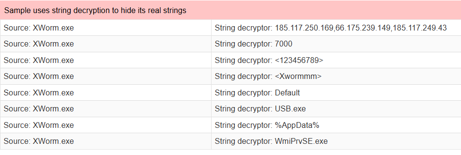
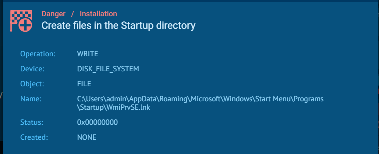
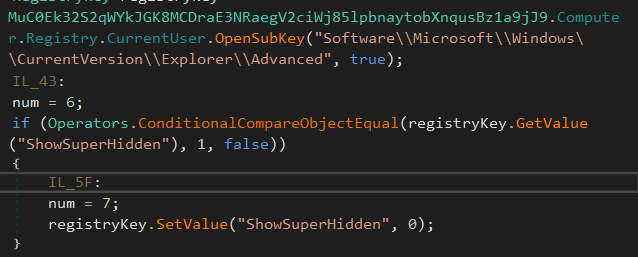

---

Пользователь загрузил вредоносный файл из почты, запустил его. Предстоит выяснить особенности функционирования данного файла.
Для безопасной работы с ВПО (сейчас задача учебная, но лучше сразу учиться такому подходу) следует использовать изолированный стенд и специальное ПО.

**DiE** (Detect it Easy) подходит для статического изучения, в данном случае больше и не потребуется. Распаковываем архив, открываем образец в DiE. Видим начальную информацию о файле - например, тип файла, библиотеку и предположение о наличии упаковщика.

Для работы нажимаем вкладку "О файле", выбираем пункт "хеш" и загружаем его на TI платформу, в нашем случае - на Virus Total.
Для ответа на вопрос о дате создания смотрим вкладку **Details**, видим **Creation Time** - это то, что нужно. (**№1 -**   
**2024-02-25 22:53:40 UTC**)

Следующий вопрос - под установщик какой официальной компании пытается мимикрировать наш образец? Для этого возвращаемся в Die и изучаем раздел **Строки** (*подраздел в О файле*). Тщательно изучив содержимое, мы сможем увидеть интересующую информацию. Компания **Adobe** стала мишенью в сокрытии истинного создателя. (**№2 - Adobe**)

Третий вопрос довольно сложен. Требуется проанализировать, сколько проверок на детектирование отладки/виртуального окружения производит образец. Чтобы ответить на данный вопрос, потребуется выполнить несколько действий.
1. Использовать инструмент *deo4dot* (https://github.com/de4dot/de4dot)|
   После сборки (или скачивания готовой сборки) потребуется запустить его из консоли с одним аргументом - исходным файлом задания. Это улучшит читаемость кода в дальнейшем.
2. Использовать инструмент *dnSpy* (https://github.com/dnspy/dnspy)
   В нем открываем наш очищенный на первом этапе файл. Далее нам понадобится раскрыть ветку *Stub()* - и поискать в ней методы, *возвращающие значение bool*. В них мы найдем те самые проверки. Например, такую проверку на **SbieDLL.dll**

Данная библиотека отвечает за отрисовку тех самых "полей" у виртуальных машин, поэтому наличие её может говорить о происходящей отладке, чего образец и пытается избежать. Таких проверок ещё 4 - а всего - 5 **(№3** - **5**).

Следующий вопрос - *какое имя дает задаче наш вредоносный образец для последующего запуска с повышенными правами?* 
Отвечать на этот вопрос можно по-разному: можно через отладку, предварительно отключив найденные ранее проверки, дойти до этого места с помощью *dnSpy* . Но мы пойдём более простым путём и воспользуемся общедоступной онлайн-песочницей *AnyRun*. Вбив в поиск хеш исходного файла, увидим множество отчётов. Откроем один из них и увидим ответ на наш вопрос *в следующей команде*. (**№4** - WmiPrvSE**)

Ответ на следующий вопрос (*Какой бинарный файл был создан в директории AppData*) найти несложно - чуть далее в предыдущем изображении видно данное имя файла, оно совпадает с именем задачи. (**№5 - WmiPrvSE.exe**)

Следующий вопрос *касается алгоритма шифрования, используемого данным образцом*. Строка с ответом даёт подсказку о том, что алгоритм состоит из трёх букв. Ищем **AES** в dnSpy - и находим множество его упоминаний. Это и есть ответ. (**№6 - AES**)****

Механизм AES реализован в .NET за счет **rijndaelManaged**. Чтобы обнаружить его (и решить предыдущую задачу честнее), ищем все методы, возвращающие **bytes** в коде. Находим первый же - и он оказывается нужным. Для ответа на вопрос про вектор инициализации необходимо пройти чуть внутрь этой вложенности.

Проходим далее в выделенный фрагмент и попадаем в класс **Настроек** . Там ищем среди всех строк нужную, она вписана открытым текстом. Этой строкой оказывается **8xTJ0EKPuiQsJVaT** (**№7 - 8xTJ0EKPuiQsJVaT**)

Следующий вопрос касается C2 (C&C) - серверов. Для простого ответа на данный вопрос возвращаемся на VirusTotal, и в разделе Community находим их даже с излишком. Нужные нам для ответа на вопрос - 185.117.250.169, 66.175.239.149, 185.117.249.43 (**№8 - 185.117.250.169, 66.175.239.149, 185.117.249.43**).

Далее необходимо понять, *с помощью какого порта вредонос обращается с C&C*. Ответить на данный вопрос можно с помощью AnyRun - переходим в раздел **Connection**, находим там известные с предыдущего шага C2-сервера и видим порт 7000 (**№9 - 7000**)

Вредонос распространяет себя с помощью подключаемых USB-устройств, заражая их. Требуется понять, какое имя он дает себе в таком случае.
Здесь можно решать либо с помощью отладки (как и многие задания ранее), но мы пойдем по чуть упрощенному сценарию. Откроем анализ ещё одной песочницы **JoeSandbox** (https://www.joesandbox.com/analysis/1796812/0/html). В отчёте найдём анализ добытых строк из образца, среди них будут те, которые мы уже использовали в ответах (например, IP-адреса серверов, порт взаимодействия, правда AES-ключ неправильный, но его мы уже нашли итак), нам нужна строка **usb.exe** (**№10 - usb.exe**).

Чтобы гарантировать себе запуск, вредонос создает особый тип файла. Для того, чтобы понять это, внимательно изучим AnyRun. В поэтапном выполнении найдём в том числе такую строку **Create files in the Startup directory**. А в ней - интересующую информацию, интересующий нас тип файла - это lnk (**№11 - lnk**)

Как мы уже увидели ранее, образец ищет библиотеку для детектирования виртуальной среды. Спрашивается имя библиотеки. Оно уже есть у нас на одном из изображений - это SbieDLL.dll (**№12 - SbieDLL.dll**).

Также вредонос использует ключ реестра для своей маскировки. Необходимо найти название этого ключа. Для ответа на этот вопрос ищем в **dnSpy** *Explorer* - и находим следующее. Как раз здесь участок кода ставит 1 в поле ShowSuperHidden - это и является ответом. (**№13 - ShowSuperHidden**)

